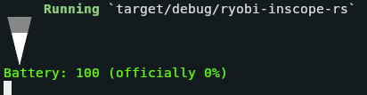

# ryobi-inscope-rs

Command-line program for working with RYOBI's Phone Works inspection scope.

More Phone Works tools could be added later.

## Usage

Requires ffplay from ffmpeg and currently only works on Unix-like platforms.

1. Turn on the inspection scope by pressing on the button for 5 seconds
2. Connect to its Wi-Fi network (default password is 12345678)
3. Run this program

Keybinds:

* <kbd>q</kbd> Quit the program
* <kbd>0</kbd> Turn off the light
* <kbd>1</kbd> Set the light level to 1
* <kbd>2</kbd> Set the light level to 2
* <kbd>3</kbd> Set the light level to 3
* <kbd>↑</kbd> Increase the light level
* <kbd>↓</kbd> Decrease the light level
